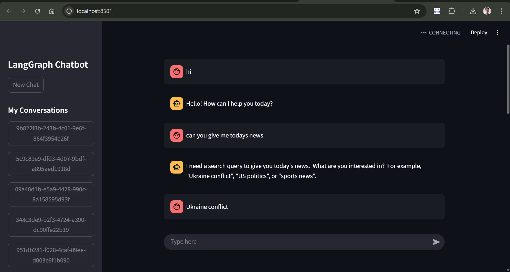

# 🤖 LangGraph AI Chatbot

This is an AI chatbot built using **LangChain, LangGraph, Streamlit, and Google Gemini (gemini-1.5-flash)**.  
It supports threaded conversations, tool integration, and real-time streaming responses.  

## 🚀 Features
- Conversation threads with memory
- LangGraph tool integration (DuckDuckGo, calculator, etc.)
- Streamlit frontend with real-time responses
- Powered by Google Gemini

## 📸 Demo Screenshot


## ⚡ Setup
```bash
git clone https://github.com/aritra042003/langgraph-chatbot.git
cd langgraph-chatbot
pip install -r requirements.txt
streamlit run streamlit_frontend_threading.py


